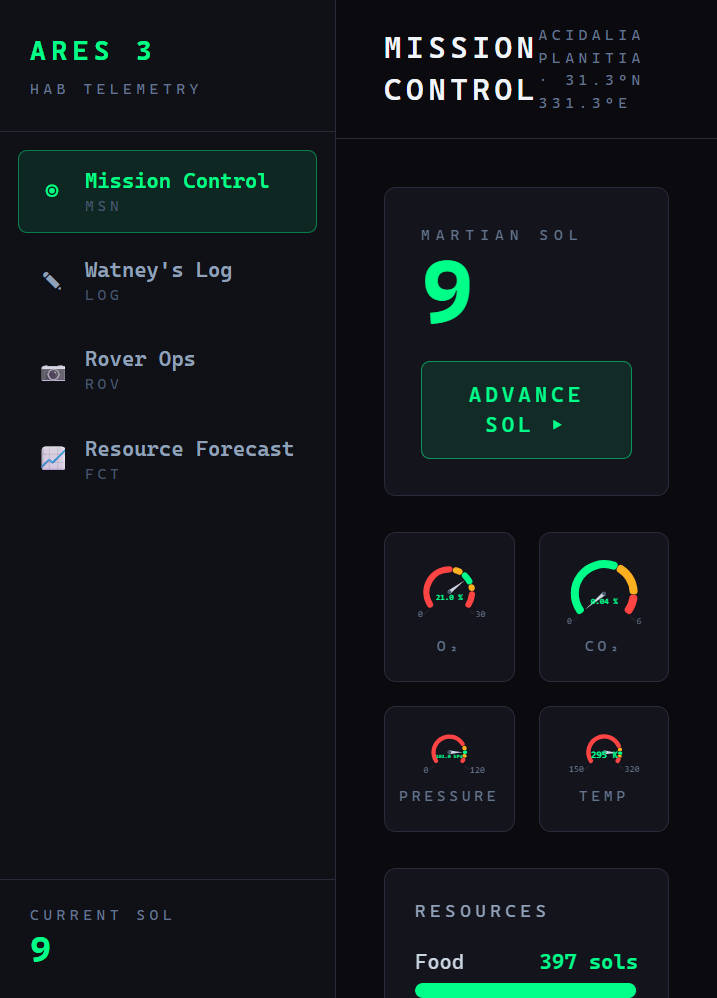

# 🚀 ARES 3 Telemetry Dashboard

> Mission Control for Mark Watney's survival on Mars — a full-stack telemetry
> dashboard inspired by Andy Weir's *The Martian*.

A Spring Boot REST API simulates the Hab's life-support telemetry (O₂, CO₂, power,
water, food, crops) seeded with canonical numbers from the novel. A React +
TypeScript dashboard renders it as a dark mission-control console, pulls live Mars
photos from NASA's Rover API through a backend proxy, and asks Claude for
Watney-style survival recommendations based on the current readings.


<sub>*Screenshot placeholder — drop `dashboard-screenshot.png` into `brand_assets/`.*</sub>

---

## 🌐 Live demo

| Surface | URL |
|---------|-----|
| Frontend (Vercel) | _coming soon_ |
| Backend (Render)  | _coming soon_ |
| Health check      | `<backend-url>/actuator/health` |

---

## 🛠 Tech stack

| Layer | Technologies |
|-------|--------------|
| **Backend** | Java 21 · Spring Boot 3.3 (Web, Data JPA, Validation, Actuator) · H2 · Lombok · JUnit 5 + Mockito · Maven |
| **Frontend** | React 19 · TypeScript (strict) · Vite · Tailwind CSS · Recharts · Axios |
| **Infrastructure** | Docker (multi-stage) · Docker Compose · GitHub Actions CI · Vercel + Render |

---

## 🏗 Architecture overview

**Layered backend.** Thin controllers handle HTTP only and delegate to services;
services hold all business logic and talk to repositories or external APIs. JPA
entities never leave the service layer — controllers exchange DTOs. Every error is
funnelled through a `GlobalExceptionHandler` (`@ControllerAdvice`) so clients get
consistent JSON, never a stack trace.

```
controller  →  service  →  repository / external API
  (HTTP)      (logic)        (H2 / NASA / Claude)
```

- **NASA rover proxy** — `NasaRoverService` calls the NASA Mars Rover Photos API
  server-side via a `RestTemplate` bean, flattens the nested JSON into
  `RoverPhotoDto`s, and keeps the API key out of the browser. Upstream failures are
  wrapped as a clean `502`.
- **Claude advisor flow** — `ClaudeAdvisorService` reads the latest `HabSnapshot`,
  classifies mission risk (LOW → CRITICAL) from the telemetry, and sends that
  context to the Anthropic Messages API. The response is returned as a
  `WatneyAdviceDto` and rendered in the dashboard's "Watney's Log".

---

## ⚡ Quick start (Docker)

Requires Docker + Docker Compose.

```bash
# Optional: export real keys (NASA falls back to DEMO_KEY; the advisor needs a key)
export NASA_API_KEY=your_nasa_key
export ANTHROPIC_API_KEY=your_anthropic_key

docker-compose up --build
```

| Service | URL |
|---------|-----|
| Dashboard | http://localhost:3000 |
| API       | http://localhost:8080 |
| Health    | http://localhost:8080/actuator/health |

---

## 🧑‍💻 Manual dev setup

**Backend** (port 8080):

```bash
cd backend
./mvnw spring-boot:run     # mvnw.cmd on Windows
```

**Frontend** (port 5173):

```bash
cd frontend
npm install
npm run dev
```

The backend's CORS config already allows the Vite dev server (`:5173`) and the
Docker frontend (`:3000`).

---

## 🔑 Environment variables

| Variable | Used by | Default | Notes |
|----------|---------|---------|-------|
| `NASA_API_KEY` | backend | `DEMO_KEY` | Free key at [api.nasa.gov](https://api.nasa.gov/) — `DEMO_KEY` is rate-limited |
| `ANTHROPIC_API_KEY` | backend | _(none)_ | Required for the advisor — [console.anthropic.com](https://console.anthropic.com/) |
| `VITE_API_BASE_URL` | frontend | `http://localhost:8080` | Backend base URL, baked at build time |

---

## 📡 API endpoints

| Method | Path | Description |
|--------|------|-------------|
| GET  | `/api/telemetry/current` | Latest Hab snapshot |
| GET  | `/api/telemetry/history?sols=10` | Last N sol readings |
| GET  | `/api/telemetry/systems` | All system statuses |
| POST | `/api/telemetry/simulate` | Advance time by N sols |
| GET  | `/api/rover/photos?sol={n}` | NASA rover photos for a sol |
| GET  | `/api/rover/latest` | Latest Curiosity photos |
| POST | `/api/advisor/analyse` | Claude analysis of current telemetry |
| GET  | `/actuator/health` | Spring health check |

---

## 🥔 The Martian simulation numbers

Telemetry is seeded with canonical figures from the novel:

| Metric | Value |
|--------|-------|
| Stranded | Sol 6 → ~Sol 549 (~543 sols) |
| Food supply | 400 sols @ 1,500 kcal/sol |
| Water (have / farm needs) | 300 L / 618 L |
| O₂ target | 21 % (fire risk > 25 %, hypoxia < 16 %) |
| CO₂ target | < 1 % (lethal > 5 %) |
| Internal pressure / temp | 101 kPa / 295 K |
| RTG output | ~100 W continuous |
| Potato harvest cycle | ~80 sols |

Calling `POST /api/telemetry/simulate` advances the sim — consuming food and EVA
filter hours, drifting the atmosphere when a system degrades, recovering water,
growing crops, and occasionally rolling a random event (dust storm, micrometeorite
strike, etc.) to give the advisor something to react to.

---

## 📂 Project structure

```
ares3-telemetry/
├── docker-compose.yml
├── .github/workflows/ci.yml         ← backend + frontend CI
├── backend/                         ← Spring Boot API
│   ├── Dockerfile                   ← multi-stage (Maven → JRE alpine)
│   └── src/main/java/com/ares3/telemetry/
│       ├── controller/  service/  repository/
│       ├── model/  config/  exception/
│   └── src/test/...                 ← 19 unit tests
└── frontend/                        ← React + TypeScript
    ├── Dockerfile                   ← multi-stage (Node → nginx)
    ├── nginx.conf
    └── src/
        ├── api/client.ts            ← single Axios client
        ├── components/  types/  lib/
```

---

*Portfolio project for the CERN Junior Full-Stack Software Engineer programme —
ref `FAP-BC-DL-2026-143-GRAE`.*

> *"I'm going to have to science the shit out of this." — Mark Watney, Sol 6*
